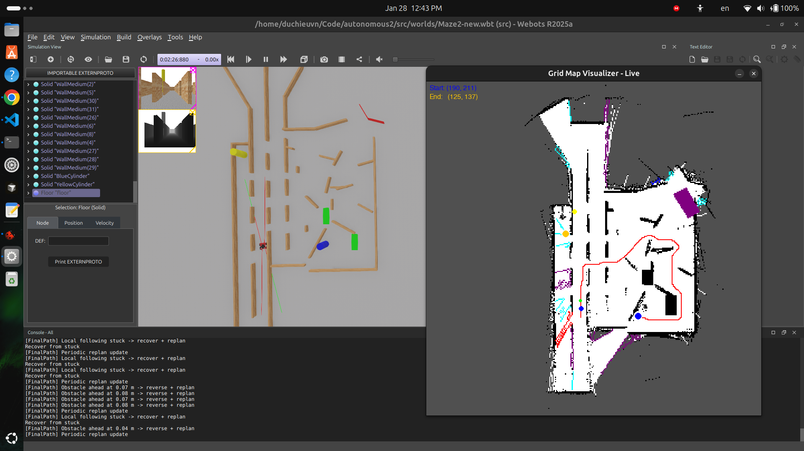
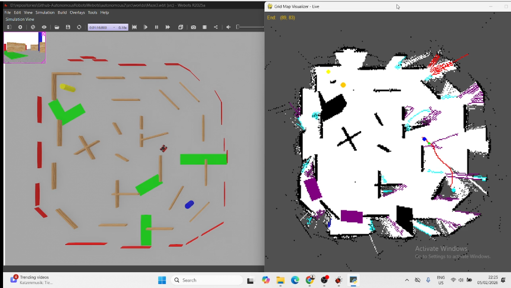

# Autonomous navigation in Webots

## Overview

This project implements an autonomous navigation pipeline for a mobile robot in a Webots simulation.

### Project goal

For all 5 given maps, the robot must:

- Navigate between the **blue** and **yellow** columns (landmarks)
- Avoid the **green area** (hazard/obstacle region)
- Find and follow an optimal path from blue to yellow

### Key approaches

- **Environment Mapping**: Builds an occupancy grid map from **LiDAR** data
- **Perception**: Detects landmarks and hazards with **camera-based color segmentation**
- **Path Planning**: Plans routes using global **A\*** algorithm with local **DWA path following**

## Results

Demo video can be seen [here](https://www.youtube.com/playlist?list=PLF5iDxYhcQyc2H5Cv31HzA4lgotNfF27Z)

<table>
<tr>
  <td align="center" width="50%"><br><b>Map 2</b></td>
  <td align="center" width="50%"><br><b>Map 3</b></td>
</tr>
</table>

### Best records

Navigation times for each maze configuration:

| Map | Start → Yellow | Start → Blue | Blue → Yellow | Total |
| --- | -------------- | ------------ | ------------- | ----- |
| 1   | 00:33          | 01:19        | 01:44         | 01:44 |
| 2   | 00:05          | 01:53        | 02:39         | 02:39 |
| 3   | 01:02          | 01:29        | 01:46         | 01:46 |
| 4   | 00:05          | 00:53        | 01:26         | 01:26 |
| 5   | 00:09          | 01:12        | 01:30         | 01:30 |

## Installation requirements

- Python 3.x
- Webots
- Python packages listed in [requirements.txt](requirements.txt)

Install the Python dependencies :

```bash
pip install -r requirements.txt
```

## Webots setup (selecting the controller)

1. Open your world in Webots.
2. In the robot node properties, set **controller** to `main`.
3. Ensure the controller directory points to [src/controllers/main](src/controllers/main) and the entry file is [src/controllers/main/main.py](src/controllers/main/main.py).
4. Start the simulation.

## Contributors

| Name         | GitHub                                           |
| ------------ | ------------------------------------------------ |
| Hieu Tran    | [@duchieuvn](https://github.com/duchieuvn)       |
| Ammar Haider | [@ammarhaiderz](https://github.com/ammarhaiderz) |
| Arman Pathan |  ------------------------------------------------|
